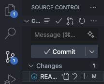

[](https://classroom.github.com/a/BMrh2GPn)


# 🧠 Git & GitHub Collaboration Cheatsheet (Team Workflow)

## 🔧 1. Setup (only once)
```bash
# Set your name and email (one-time setup) - will be reflected on git commits
git config --global user.name "Your Name"
git config --global user.email "you@example.com"

# Clone the repository (do this once)
git clone https://github.com/BT3103AppDev1/l2-finaltermproject-2425s2l2_group_9.git
cd l2-finaltermproject-2425s2l2_group_9
```

---

## 🌱 2. Create and Switch to Your Own Branch
```bash
# Make sure you're on the main branch
git checkout main

# Pull the latest changes
git pull origin main

# Create and switch to your new branch
git checkout -b <your-branch-name>
```

📝 **Branch naming convention:**  
<your-name>

---

## ✍️ 3. Make Changes
- Add or edit files
- Test your code (if needed)

Then, run:
```bash
# Check which files were changed
git status

# Stage the files you want to commit
git add .

# Commit your changes with a clear message
git commit -m "Short description of what you did"
```

- Alternatively, commit through vscode source controls instead of command line tools:


"+" sign is for staging changes.


---

## 🔄 4. Push Your Branch to GitHub
```bash
git push origin your-branch-name
```

- Alternatively, push through vscode source controls via "sync" button (same position as "commit")

---

## 📦 5. Create a Pull Request (PR) - when you want to merge your changes to the main branch
1. Go to the repository on GitHub.
2. Click the **“Compare & pull request”** button.
3. Add a **descriptive title** and comment on what you did.
4. Submit the pull request to merge into `main`.
5. Tag someone (xinyu) to **review** your PR if needed.

---

## 🔄 6. Keeping Your Branch Updated 
- a good practice would be: everytime do this before you continue developing your own branch, ensure your branch is updated before you create a pull request

# Step 1: Switch to your local main branch
git checkout main

# Step 2: Fetch and update local main with origin/main
git fetch origin
git pull origin main
# OR: git merge origin/main (if you prefer manual control)

# Step 3: Switch to your branch
git checkout your-branch-name

# Step 4: Merge updated main into your branch
git merge main

# OR: rebase for cleaner history (optional)
# git rebase origin/main
```

---

## ✅ 7. After Your PR is Merged
```bash
# Switch to main and pull latest
git checkout main
git pull origin main

# Delete your old branch (optional)
git branch -d your-branch-name            # delete local
git push origin --delete your-branch-name  # delete remote
```

---

## 💡 Tips [Important!!!]
- Pull frequently from `main` to avoid conflicts. 
- Keep your commits small and focused.
- Write clear commit messages and PR titles.
